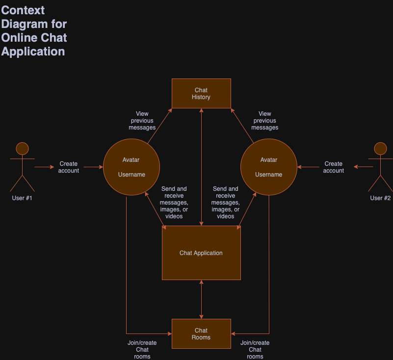

# Online Chat Application

A real-time chat application that allows users to communicate with each other in private or group chats.

## Product Vision

The vision of this online chat application is to create a seamless, engaging, and scalable online chat platform where users can connect with each other in real-time. Whether it’s a casual conversation in a public room or a secure private chat, the application aims to bring the ease of communication and personalization into one platform. With real-time messaging, customizable user profiles, and public and private chat rooms, this application becomes the go-to destination for socializing, collaborating, and connecting worldwide. Our platform aspires to combine security, speed, and a modern, user-friendly interface to deliver a superior communication experience.

## Core Features

- Real Time Messaging: Messages are delivered in real time between users.
- Chat Rooms: Users can create and join public or private chat rooms.
- User Profiles: Users can create profiles with a username and avatar.
- Media Sharing: Users can send images and videos in addition to text.
- Chat History: Users can view previous messages.

## Additional Features

- Performance: Messages should take less than 2 seconds to be sent out.
- Ease of Use: The UI should be simple enough to make sending messages easy.

  
